# PowerToys.Run.Plugin.TemplateRunner

A [PowerToys](https://github.com/microsoft/PowerToys) plugin to manage and parameterize some simple scripts all inside PowerToys.

While this plugin may seem like some weird unnecessary mix between the command search and the command execution plugins, its templating ability combined with simple result pipe-back to PowerToys allows it to become a great tool for those tiny quality of life features, that one would rather not make an entire plugin of, as doing that is considerably harder and an annoying than making a simple 1-2 line script

See some [examples](#examples) below

# Installation

## Manual

- Download the latest [release](https://github.com/Heck-R/PowerToys.Run.Plugin.TemplateRunner/releases)
- Unzip the contents into the PowerToys Plugin folder  \
  Usual locations include:
  - `C:\Program Files\PowerToys\PowerToys.exe`
  - `%LOCALAPPDATA%\Microsoft\PowerToys\PowerToys Run\Plugins`
- Restart PowerToys

## Automatic

Use [ptr](https://github.com/8LWXpg/ptr), which is a nice plugin manager CLI tool

```
ptr add TemplateRunner Heck-R/PowerToys.Run.Plugin.TemplateRunner
```

# Features

There are 3 major sections

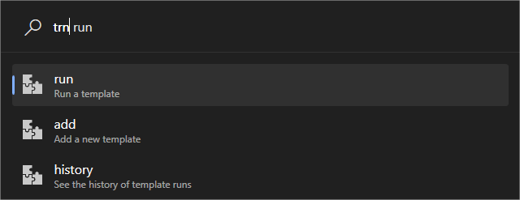

Both typing and arrow keys and enter (or clicks) can navigate the menu, as it is effectively autofill

## Add

This menu is for defining template commands to be executed later

To define a command, use the following format (check the explanation and examples below)  \
(notation help: `<>` means it is to be replaced, `[]` means optionality, `...` means it continues the same way)  \
`<alias><sep><mode>[<sep><timeoutMs>][<sep><parameter>[...]]<sep><sep>[<workingDir><sep>]<executable>[<sep><argument>[...]]`

### Explanation

The above format uses the following blocks to be replaced:
- `<sep>`: This is the separator character for the template  \
  The separator character is chosen by the user in every template, and it is the first non-regex-word character  \
  The reason for this dynamic separator is that there is no really good choice of a static separator, as any character could appear almost anywhere in the user input  \
  While escaping is a common solution, it is generally an awful experience to do, so allowing the user to choose the character will always allow the user to select one that is not used anywhere at all  \
  This can also be the space character, but that may be hard to see at some places  \
  A good separator character is for example `|`, but any bulkier rare character can be a good choice  \
  Using the suggested one, the format instantly looks easier on the eye:  \
  `<alias>|<mode>[|<timeoutMs>][|<parameter>[...]]||[<workingDir>|]<executable>[|<argument>[...]]`
- `<alias>`: The name and id of the template, used to run the template command
- `<mode>`: The mode describes how the template will be executed.  \
    It must be one of the following:
  - `launch`: The described process is started, and PowerToys run closes immediately  \
    - From the optional segments, `<workingDir>` is parsed
  - `return`: The described process is started, and awaited for. The result then appears as a new result  \
    Note that PowerToys Run will not respond while the process is working  \
    - From the optional segments, `<workingDir>` and `<timeoutMs>` are parsed
  - `uri`: Similar to launch, but it launches an uri / protocol (e.g.: `https://<website>`, `mailto:<mail_address>` etc.)
    - From the optional segments, nothing is parsed, so after the double separator, only `<executable>` can and must be passed
- `<timeoutMs>`: It describes the amount of milliseconds (`>= 0` whole number) to wait for the process to finish on its own, to avoid PowerToysRun being permanently stuck  \
  `-1` means infinite waiting time
- `<parameter>`: A string to be replaced on the right side of the double separators, basically the values that describe the command to be executed  \
  This can be anything, but as the replacement is a simple string replacement, it must be unique  \
  In the examples, these are usually wrapped inside `<>` for readability, but it can really be anything  \
  Naturally, it cannot include the separator  \
  There can be any amount of these
- `<executable>`: This is the "thing" to be executed, which is effectively a file that can be found on the `PATH`, or a full file path  \
  In `uri` mode, this may be URL escaped based on the default browser, but most modern browsers can handle auto escaping spaces and non-ambiguous characters
- `<workingDir>`: The working directory for the process to be executed  \
  Leaving it empty defaults to PowerToys Run's working directory
- `<argument>`: Argument to be passed to the process to be executed  \
  There can be any amount of these  \
  One separate argument is guaranteed to be passed as a separate process argument, although the specific process itself may or may not join them together regardless

### Examples

The above may look very intimidating at first, but in practice it is actually quite easy  \
See some simple examples (that are not very useful, but help with understanding):
- `notepad|launch|||notepad`
  - This simply opens notepad, it has to argument or anything fancy
- `MyScript|return|-1|<param1>|<param2>||C:/working/directory|C:/path/to/script.bat|LiteralScriptArgument|Interpolated<param1>ScriptArgument|<param2>`
  - This one is a more realistic one, and it's basically the same as running the above `.bat` file with 3 script parameters, but the plugin also inserts 2 template parameters into the call, which
- `google|uri|<search>||https://google.com/search?q=<search>`
  - This will open google in the default browser with the search terms

### Example images

The plugin actively shows whether the template is valid or not, and it also shows the parsed values

Good template, all the values can be seen at the right places  \
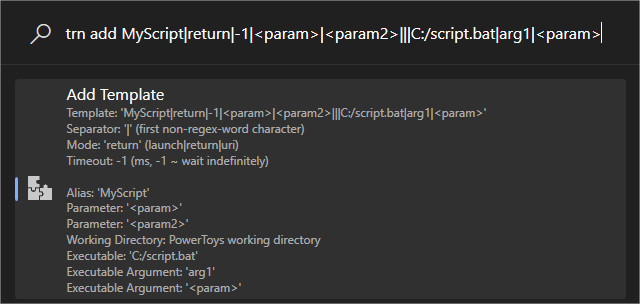  \
Pressing enter on a well defined template will save it, and move to the run menu, immediately inserting the alias

Bad template, where the message shows that the timeout is bad  \
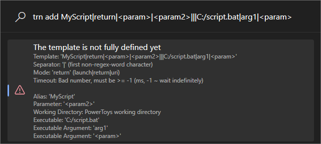

## Run

This menu is for running already created template commands

To do that, use the following format to parameterize the template (check the explanation and examples below)  \
(The notation is the same as for the [add](#add) menu)  \
`<alias>[<sep><argument>[...]]`

### Examples

These example are for the example templates in the [add](#add) section:
- `notepad`
  - No arguments, no problem
- `MyScript| |ScriptArgument3`
  - This passes two parameters, a space, and `ScriptArgument3`  \
    As a refresher, the template's end was the following: `|C:/path/to/script.bat|LiteralScriptArgument|Interpolated<param1>ScriptArgument|<param2>`  \
    This means that this execution is effectively the same as the cmd command `C:/path/to/script.bat LiteralScriptArgument "Interpolated ScriptArgument" ScriptArgument3`
- `google|PowerToys Run`
  - This will google with the search `PowerToys Run`

### Example images

The plugin actively shows whether the template is properly parameterized or not, and it also shows the parsed values  \
A proper run must define all template parameters, but they can be empty strings

The templates are listed, and can be searched  \
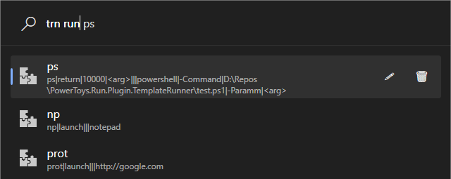  \
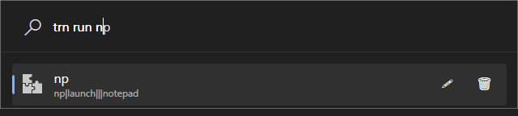  \

Good run, all parameters are defined  \
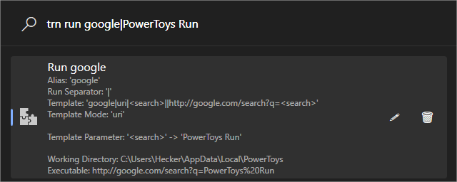  \
Pressing enter on a well defined template will run it

When the plugin is set to be available in the global scope, the run menu features are exposed without even the run prefix  \
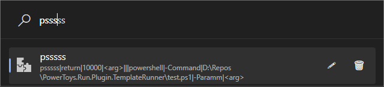

Good return run, output and exit code can be seen  \
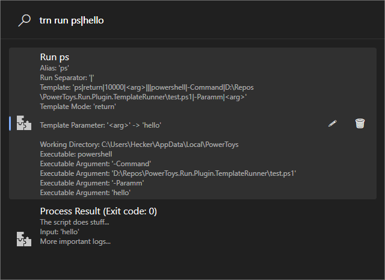

Good return run with non-zero exit code  \
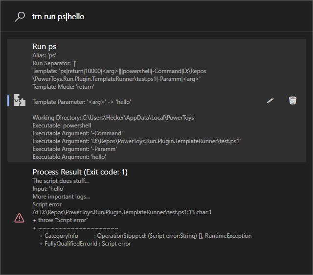

Bad run, where the message shows that there are an inappropriate amount of parameters  \
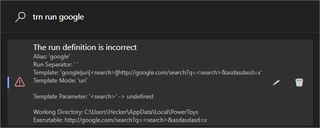  \
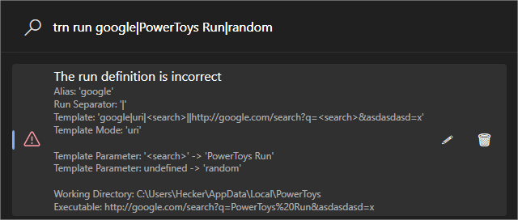

Templates can be edited and deleted with the context menu  \
The edit redirects to the add menu, with the template already inserted  \
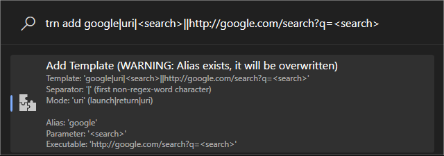  \

## History

Show the history of the runs (only those that were actually executed, and each only once)

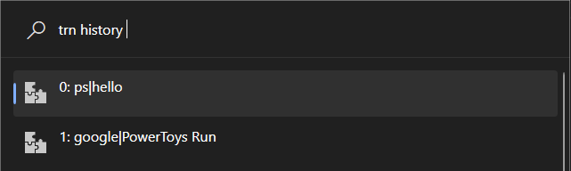

Selecting a history item will redirect to the run menu, with the run already inserted

# Credits

- Project template: https://github.com/hlaueriksson/Community.PowerToys.Run.Plugin.Templates
- Dice icon: <a href="https://www.freepik.com/icon/puzzle_6202531">Icon by Freepik</a>

# Donate

I'm making tools like this in my free time, but since I don't have much of it, I can't give all of them the proper attention.

If you like this tool, you consider it useful or it made you life easier, please do not hesitate to thank/encourage me to continue working on it with any amount you see fit. (You know, buy me a cup of coffee / gallon of lemonade / 5-course gourmet dish / whatever you think I deserve 🙂)

<a href="https://www.paypal.com/paypalme/HeckR9000">
    
</a>
